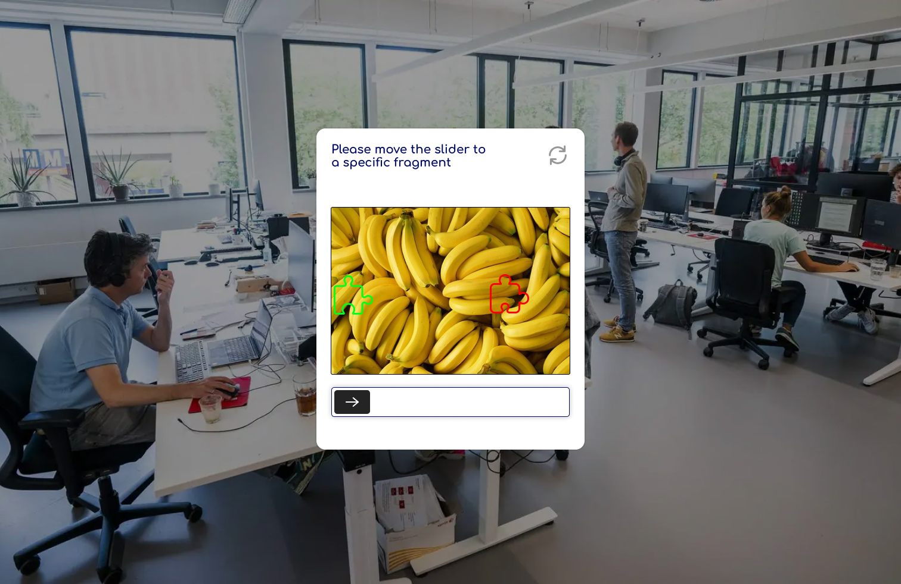

<h1 align = "center">
     
     
    🤖 Captcha 🤖
     
     
</h1>
<a href="https://roman-artemiev.github.io/ra-captcha/" >
    

        🤖 "Captcha: Test your humanity by solving a quick puzzle. Type the distorted characters or select the matching images to prove you're a real person. 🤖
    

</a>

<h3>Main features:</h3>

 - JS
 - Jquery
 - API: Unsplash (https://unsplash.com/developers)
 - HTML
 - CSS
 - UX & UI design
